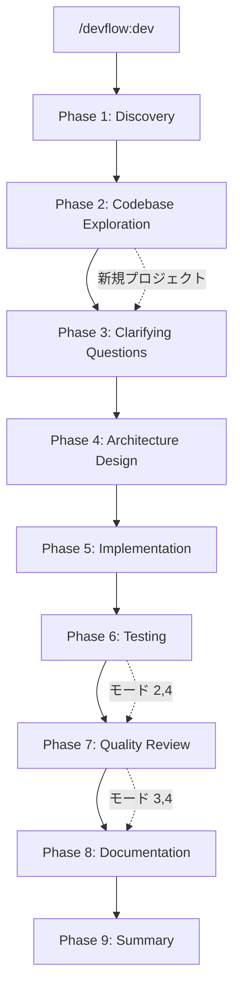

[English README](README.md)

# DevFlow

「こんなの作りたい」って伝えるだけ。設計もテストも README も、全部やっといたけど？

DevFlow は Claude Code プラグインです。6つの専門エージェントがコードベース分析から設計・実装・テスト・レビュー・ドキュメント生成まで自動で回します。仕様書がなくても、対話で要件を固めてから開発が始まります。

## DevFlow を使うとどうなる？

```
あなた:  /devflow:dev
        「Gemini APIを使ったチャット機能を追加したい」

DevFlow: いくつか確認させてください:
         - Web UI は必要？それともCLI？
         - 会話履歴の保存は？
あなた:  Web UIで。履歴はセッション中だけでOK。

DevFlow: 了解！開発モードはどうしますか？
         [1. フル]  [2. テストなし]  [3. レビューなし]  [4. 爆速]
あなた:  (「4. 爆速」をクリック)

DevFlow: 爆速モードで進めます。
         → explorer がコードベースを分析中...
         → planner が設計書を作成中（3つのアーキテクチャ候補）...
         → どのアーキテクチャにしますか？ [候補1] [候補2] [候補3]
あなた:  (「候補2」をクリック)
         → coder x 2 が並列で実装中...
         → documenter がドキュメント生成中...
         完了！
```

1回の指示で、開発サイクルが自動で走ります。

## 特徴

- **対話で要件を固める** — 仕様書がなくても数問の質問で要件を整理してくれます
- **コードベース分析** — explorer エージェントが設計前にコードベースを分析。実際のコード構造に基づいた変更を実現します
- **アーキテクチャ候補** — planner が3つの設計案を Pros/Cons 付きで提案。実装前にユーザーが選択します
- **多言語対応** — TypeScript/JavaScript、Python、Go、Rust をサポートしています
- **自動検出** — プロジェクト構造、テストフレームワーク、コーディング規約を自動認識します
- **並列実行** — coder + tester を並列で実行します（coder の数はタスクに応じて動的に決定）
- **開発モード** — プロトタイプなら「テスト・レビューなし」で爆速。本番用なら全部入り
- **自動修正ループ** — テストが落ちたら coder が自動で修正して再テスト。手動の往復ゼロです
- **信頼度スコアリング** — reviewer は信頼度 75/100 以上の指摘のみ報告。量より質です
- **セッション永続化** — 進捗を `.devflow/session.md` に保存。中断やコンテキスト圧縮後も復帰可能です
- **セッション履歴** — 完了セッションを自動アーカイブ。`/devflow:history` でいつでも過去の決定を参照できます
- **セキュリティチェック** — XSS、SQLインジェクション、コマンドインジェクションなどを自動検出します
- **メモリ管理** — エージェントがパターンを記録。使うほど速くなります

## インストール

[Claude Code](https://claude.com/claude-code) >= 1.0.0 が必要です。

```
/plugin marketplace add takuya-motoshima/flux
/plugin install devflow@flux
```

インストール後、**Claude Code を再起動**してエージェントを読み込みます。`/agents` で確認できます。

> [!NOTE]
> `agents: Invalid input` 等のバリデーションエラーが出る場合、プラグインキャッシュをクリアして再試行:
> ```
> rm -rf ~/.claude/plugins/cache/
> /plugin install devflow@flux
> ```

## 使い方

### カスタムコマンドで簡単実行（推奨）

```bash
/devflow:dev       # 開発開始（PM ワークフロー）
/devflow:explore   # コードベース分析（explorer エージェント）
/devflow:history   # 過去のセッション履歴を参照
/devflow:design    # 設計作成
/devflow:review    # コードレビュー
/devflow:test      # テスト実行
/devflow:docs      # ドキュメント生成
```

### または、個別のエージェントを直接呼び出す

```
@devflow:explorer   # コードベース分析のみ
@devflow:planner    # 設計のみ
@devflow:coder      # 実装のみ
@devflow:tester     # テストのみ
@devflow:reviewer   # レビューのみ
@devflow:documenter # ドキュメント生成のみ
```

## ワークフロー: 9フェーズパイプライン



### エージェント一覧

| エージェント | 役割 | 出力 |
|------------|------|------|
| `explorer` | コードベース分析: 実行パストレース、アーキテクチャマッピング | 分析レポート（PM経由） |
| `planner` | 設計: アーキテクチャ候補、影響範囲分析 | `docs/DESIGN.md` |
| `coder` | 実装: 多言語対応コーディング | ソースコード |
| `tester` | テスト: フレームワーク自動検出、テスト実行 | `docs/TEST_SPEC.md`, `docs/TEST_REPORT.md` |
| `reviewer` | レビュー: 信頼度スコアリング付き品質・セキュリティチェック | `docs/REVIEW.md` |
| `documenter` | ドキュメント: README、API仕様書 | `README.md`, `docs/` |

## フェーズ詳細

### Phase 1: Discovery（要件ヒアリング）

7つの原則に従って質問する:

1. **1回の応答で質問は最大2つ** — 一度に大量の質問をしない
2. **簡単な質問から始める** — まず「何を作りたいか」を聞く
3. **段階的に深掘りする** — 1つずつ掘り下げていく
4. **文脈を理解する** — 「何を」だけでなく「なぜ」も確認する
5. **柔軟に対応する** — 明らかなことは質問せず確認するだけ
6. **冗長な質問を避ける** — 推測できる情報は聞かない
7. **「推奨で」を受け入れる** — 「推奨で」「おまかせ」と言えばベストプラクティスを即座に適用

ヒアリング後、開発モードを選択する（クリック選択）:

| モード | パイプライン | ユースケース |
|--------|------------|-------------|
| 1. フル | 設計 → 実装 → テスト → レビュー → ドキュメント | 本番品質（推奨） |
| 2. テストなし | 設計 → 実装 → レビュー → ドキュメント | テストが既にある場合 |
| 3. レビューなし | 設計 → 実装 → テスト → ドキュメント | 内部向けコード |
| 4. 爆速 | 設計 → 実装 → ドキュメント | プロトタイプ、実験 |

### Phase 2: Codebase Exploration（コードベース分析）

既存プロジェクトのみ実行（新規プロジェクトではスキップ）。2-3個の explorer エージェントが並列でコードベースを分析する:

- **Explorer 1**: 類似機能と関連コードパスのトレース
- **Explorer 2**: アーキテクチャ層、パターン、コンポーネント境界のマッピング
- **Explorer 3**: 既存実装の規約と依存関係の分析

結果は `.devflow/research.md` に集約され、以降のフェーズで活用される。

### Phase 3: Clarifying Questions（追加質問）

分析結果を踏まえて、エッジケース、エラーハンドリング、統合ポイント、後方互換性、パフォーマンス要件について質問する。**このフェーズはスキップされない。**

### Phase 4: Architecture Design（設計）

planner が `docs/DESIGN.md` を作成し、**3つのアーキテクチャ候補**を提示する:

- **候補1: 最小変更** — 既存コードを最大限活用
- **候補2: クリーンアーキテクチャ** — 保守性重視
- **候補3: 実用的バランス** — 速度と品質のバランス

各候補に Pros/Cons と推奨案が付く。実装前にクリック選択で決定する。

### Phase 5: Implementation（実装）

planner の並列実行推奨に基づいて coder エージェントを実行する。テストが有効な場合、tester Phase 1（テスト仕様作成）が coder と並列で実行される。

### Phase 6: Testing（テスト）

tester Phase 2 がテストを実行する。失敗時は coder が自動修正して再テスト（最大3回リトライ）。モード 2, 4 ではスキップ。

### Phase 7: Quality Review（レビュー）

reviewer が**信頼度スコアリング**（0-100）でコードを分析する。信頼度 >= 75 の指摘のみ報告される。対応をクリック選択で決定する:

- **今すぐ修正** — coder が問題を即座に修正
- **後で修正** — 記録して先に進む
- **そのまま進む** — 変更なし

モード 3, 4 ではスキップ。

### Phase 8-9: Documentation & Summary（ドキュメント・完了）

documenter がドキュメントを生成・更新する。完了フェーズでは報告を提示し、セッションを `.devflow/history/` にアーカイブする。

## エージェント詳細

### explorer

既存コードベースを分析し、設計判断に活用する。**読み取り専用** — コードを変更できない。

- **専門領域**: エントリポイント特定、実行フロートレース、アーキテクチャ層マッピング、設計パターン抽出
- **出力**: 必読ファイルリスト（5-10件）、file:line 参照付き
- **特徴**: 実際のコード構造に基づいた深い分析を提供し、planner と coder の判断材料を作る

### planner

要件を実装タスクに分解し、設計書を作成する

- **専門領域**: タスクの依存関係分析、影響範囲の特定、アーキテクチャ候補生成、並列化グループの推奨
- **出力**: `docs/DESIGN.md`（概要、影響分析、アーキテクチャ候補、技術スタック、ファイル構成の固定構造）
- **特徴**: 3つの設計案をトレードオフ付きで生成する。どのタスクが並列実行可能かを判断し、coder の配分を最適化する

### coder

割り当てられたタスクをプロジェクトの規約に従って実装する

- **専門領域**: 多言語対応（TypeScript/JavaScript, Python, Go, Rust）、コーディング規約の自動検出
- **コーディング規約**: 関数20-30行以内、型安全性、各言語のリンター準拠
- **特徴**: 1行のコードを書く前に既存コードのスタイルを読み取る。1インスタンス1タスク — スコープの肥大化なし

### tester

テスト仕様書の作成とテスト実行を2フェーズで行う

- **専門領域**: フレームワーク自動検出 — Vitest, Jest, Mocha, pytest, Go testing, cargo test
- **Phase 1**（coder と並列）: `docs/TEST_SPEC.md` を作成（テストカテゴリ: 正常系、異常系、境界値）
- **Phase 2**（coder 完了後）: テストコードを実装、テスト実行、`docs/TEST_REPORT.md` を作成（サマリ、カバレッジ、カテゴリ別結果）
- **特徴**: 実装コードは変更しない。結果を報告し、修正は coder が担当する

### reviewer

コード品質とセキュリティをレビューする。**読み取り専用** — ソースコードを変更できない

- **専門領域**: 可読性、保守性、型安全性、セキュリティ、パフォーマンス
- **信頼度スコアリング**: 各指摘に 0-100 のスコアを付与。信頼度 >= 75 のみ報告
- **セキュリティチェック**: XSS, SQLインジェクション, コマンドインジェクション, CSRF, 秘密鍵漏洩, パストラバーサル。さらに言語固有のチェック（JSのプロトタイプ汚染、Pythonのpickleデシリアライゼーション、Goのレースコンディション、Rustのunsafeブロック）
- **出力**: `docs/REVIEW.md`（Critical/Warning/Good の指摘事項、各指摘に [Confidence: XX] と file:line 参照付き）
- **特徴**: 量より質。問題だけでなく良いコードも指摘する

### documenter

プロジェクトドキュメントを生成・更新する。**ソースコード変更不可** — `.md` と `.yaml` ファイルのみ編集

- **専門領域**: README 自動生成、条件付きの API 仕様書・アーキテクチャドキュメント
- **条件付き出力**:
  - `docs/ARCHITECTURE.md` — マルチサービス/マルチレイヤーのプロジェクトのみ
  - API仕様書（OpenAPI 3.0） — HTTP API エンドポイントがある場合のみ
  - CLI ツール、ライブラリ、単一モジュールのプロジェクトではスキップ
- **特徴**: README と DESIGN.md の内容重複を避ける。README は使い方、DESIGN.md は設計をカバーする

## 出力例

### 要件ヒアリング

```
あなた:  /devflow:dev
        「タスク管理のREST APIを作りたい」

DevFlow: タスク管理のREST APIですね。2つ確認させてください:
         - 言語/フレームワークは決まっていますか？（Express, FastAPI, Gin 等）
         - ユーザー認証は必要ですか？
あなた:  Express + TypeScript。認証はJWTで。

DevFlow: 了解です。もう1つ:
         - データベースは必要ですか？必要なら何を使いますか？
あなた:  PostgreSQL + Prisma で。

DevFlow: 理解した内容をまとめます:
         - Express + TypeScript の REST API
         - JWT認証（ユーザー登録・ログイン）
         - PostgreSQL + Prisma ORM
         - タスクのCRUD操作

         開発モードはどうしますか？
         [1. フル]  [2. テストなし]  [3. レビューなし]  [4. 爆速]
```

### docs/DESIGN.md

```markdown
## Overview
JWT認証付きのタスク管理REST API。
ユーザーは登録・ログインし、個人のタスクをRESTfulエンドポイントで管理できる。

## Architecture Candidates

### Option 1: Minimal Changes
シンプルなExpress routerとmiddlewareの構成。
- Pros: 実装が速い、理解しやすい
- Cons: スケールしにくい、密結合

### Option 2: Clean Architecture
controller、service、repositoryの層構造。
- Pros: テスト容易、保守性高、明確な境界
- Cons: ボイラープレートが多い、初期開発が遅い

### Option 3: Pragmatic Balance
controller + serviceレイヤー（repository抽象化なし）。
- Pros: 構造と速度のバランスが良い
- Cons: 複雑化時にリファクタリング必要

### Recommendation
Option 2 (Clean Architecture) — JWT認証とCRUD操作は明確な分離の恩恵を受ける。
ボイラープレートの追加コストはテスト容易性で回収できる。

## Tech Stack
- Runtime: Node.js + TypeScript
- Framework: Express
- ORM: Prisma
- DB: PostgreSQL
- Auth: JWT (jsonwebtoken)

## File Structure
src/
├── controllers/
│   ├── taskController.ts
│   └── authController.ts
├── services/
│   ├── taskService.ts
│   └── authService.ts
├── middleware/
│   └── auth.ts
├── prisma/
│   └── schema.prisma
└── index.ts
```

### docs/REVIEW.md

```markdown
## Summary
Score: 8/10
TypeScript の型が適切に使われた、整理されたExpress API。エラーハンドリングも一貫している。

## Findings

### Critical (Must Fix)
- **[Confidence: 95]** [src/middleware/auth.ts:15] JWTシークレットがハードコードされている。
  修正: 環境変数 `process.env.JWT_SECRET` に移行する。

### Warning (Recommended Improvement)
- **[Confidence: 80]** [src/controllers/taskController.ts:42] リクエストボディの入力バリデーションが不足。
  修正: zodスキーマバリデーションを追加する。

### Good (Positive Examples)
- 全ルートで一貫したエラーハンドリングパターン
- Prisma型の適切な使用 — `any` の使用なし

## Security Check
問題なし。ただし: JWTシークレットのハードコード（上記Critical参照）、2エンドポイントで入力バリデーション不足。

## Conclusion
- Security Risk: Medium（デプロイ前にJWTシークレットの修正必須）
- Maintainability: High
- Extensibility: High
```

## セッション永続化

DevFlow は全状態を `.devflow/session.md` に保存する:

- **Requirements**: 目標、機能、技術スタック、制約事項
- **Decisions**: ヒアリングの Q&A、アーキテクチャ選択、レビュー対応
- **Progress**: フェーズごとの完了状態

長時間セッションでコンテキスト圧縮が発生した場合、`.devflow/session.md`、`.devflow/research.md`、`docs/DESIGN.md` から自動的に状態を復帰する。

完了セッションは `.devflow/history/` にセッションと設計書のペアでアーカイブされる。`/devflow:history` で過去のセッションを検索できる。

## こんなときに使う / 使わない

**DevFlow を使う:**
- 新規プロジェクトをゼロから立ち上げるとき
- 複数ファイルにまたがる機能追加
- 仕様が曖昧で、要件を整理しながら進めたいとき
- 既存プロジェクトのリファクタリング（explorer がコードベースを事前分析）
- 設計・テスト・レビュー・ドキュメントまで一気に仕上げたいとき

**DevFlow を使わない:**
- 1行のバグ修正やタイポ修正
- 仕様が完全に決まっている単純なタスク
- 緊急のホットフィックス（ヒアリングのステップが不要な場合）
- 個別の作業 — テストだけなら `/devflow:test`、レビューだけなら `/devflow:review`、ドキュメントだけなら `/devflow:docs` を直接使う方が早い

## ベストプラクティス

1. **フル開発モードを基本にする** — テストとレビューをスキップすると品質が落ちる。プロトタイプや実験の場合のみモード4を使う
2. **ヒアリングで「推奨で」を活用する** — 技術選定に迷ったら「推奨で」と答えるだけでベストプラクティスが適用される
3. **既存プロジェクトでは変更目的を明確に伝える** — 「認証を追加」より「JWT認証を追加してユーザー登録・ログインAPIを実装」の方が精度が上がる
4. **`/devflow:explore` で事前分析する** — 複雑なコードベースでは、explore を先に実行して構造を理解してから開発すると精度が上がる
5. **履歴で過去の判断を確認する** — 過去の開発を引き継ぐとき、`/devflow:history` で以前の決定事項を確認できる
6. **個別コマンドも使いこなす** — テストだけ再実行したいなら `/devflow:test`、レビューだけなら `/devflow:review`、ドキュメントだけなら `/devflow:docs` がフルパイプラインより効率的

## Hooks

エージェントの開始・終了時に SubagentStart/Stop フックで通知されます。

デフォルトではターミナルに通知を表示します。`hooks/hooks.json` をカスタマイズして Slack webhook やログ記録などを追加できます。

## アンインストール

```
/plugin uninstall devflow@flux
```

## アップデート

```
rm -rf ~/.claude/plugins/cache/
cd ~/.claude/plugins/marketplaces/flux && git pull
```

アップデート後は Claude Code を再起動してください。

## 関連リンク

- [Claude Code プラグイン](https://code.claude.com/docs/ja/plugins)
- [プラグインマーケットプレイス](https://code.claude.com/docs/ja/plugin-marketplaces)
- [サブエージェント](https://code.claude.com/docs/ja/sub-agents)
- [プラグインリファレンス](https://code.claude.com/docs/ja/plugins-reference)

## ライセンス

MIT

## 著者

Takuya Motoshima ([@takuya-motoshima](https://github.com/takuya-motoshima)) / [X](https://x.com/takuya_motech)
