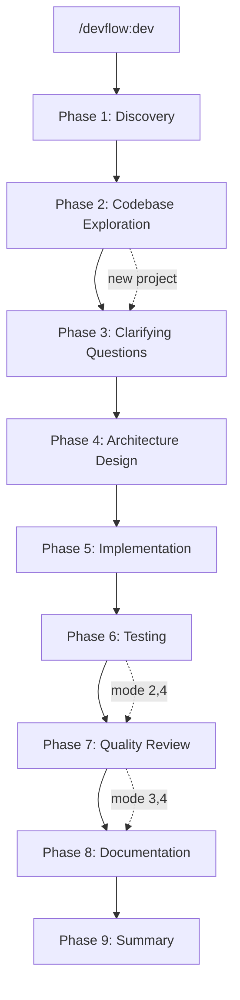

[日本語版はこちら](README.ja.md)

# DevFlow

Just say what you want to build. Design, tests, README — done. You're welcome.

DevFlow is a Claude Code plugin. 6 specialized agents handle the full cycle — codebase exploration, design, implementation, testing, review, and documentation — automatically. No spec doc needed; it starts by asking the right questions.

## What happens when you run DevFlow?

```
You:     /devflow:dev
         "Add a chat feature using Gemini API"

DevFlow: Let me ask a few questions:
         - Do you need a Web UI or CLI?
         - Should conversation history be saved?
You:     Web UI. Session-only history is fine.

DevFlow: Got it! Which development mode?
         [1. Full]  [2. No test]  [3. No review]  [4. Speed]
You:     (clicks "4. Speed")

DevFlow: Speed mode it is.
         → explorer analyzing codebase...
         → planner creating design doc (3 architecture candidates)...
         → Which architecture? [Option 1] [Option 2] [Option 3]
You:     (clicks "Option 2")
         → coder x 2 implementing in parallel...
         → documenter generating docs...
         Done!
```

One instruction, and the entire development cycle runs automatically.

## Features

- **Conversational requirements** — A few questions to clarify what you need. No spec doc required.
- **Codebase exploration** — Explorer agents analyze your codebase before design, so changes are informed by actual code structure.
- **Architecture candidates** — Planner proposes 3 architecture options with pros/cons. You choose before implementation begins.
- **Multi-language** — TypeScript/JavaScript, Python, Go, and Rust supported.
- **Auto-detection** — Automatically recognizes project structure, test frameworks, and coding standards.
- **Parallel execution** — coder + tester run in parallel (number of coders scales dynamically per task).
- **Development modes** — Skip tests and reviews for rapid prototyping. Or go full pipeline for production.
- **Auto-fix loop** — Tests fail? coder automatically fixes the code and retests. Zero manual back-and-forth.
- **Confidence scoring** — Reviewer reports only high-confidence findings (>= 75/100). Quality over quantity.
- **Session persistence** — Progress is saved to `.devflow/session.md`. Resume after interruption or context compaction.
- **Session history** — Completed sessions are archived. Look up past decisions anytime with `/devflow:history`.
- **Security checks** — Automatically detects XSS, SQL injection, command injection, and more.
- **Memory** — Agents record patterns. Gets faster the more you use it.

## Installation

[Claude Code](https://claude.com/claude-code) >= 1.0.0 required.

```
/plugin marketplace add shumatsumonobu/flux
/plugin install devflow@flux
```

After installation, **restart Claude Code** to load the agents. Verify with `/agents`.

> [!NOTE]
> If you get validation errors like `agents: Invalid input`, clear the plugin cache and retry:
> ```
> rm -rf ~/.claude/plugins/cache/
> /plugin install devflow@flux
> ```

## Usage

### Custom Commands (Recommended)

```bash
/devflow:dev       # Start development (PM workflow)
/devflow:explore   # Analyze codebase with explorer agents
/devflow:history   # Browse past session history
/devflow:design    # Create design document
/devflow:review    # Code review
/devflow:test      # Run tests
/devflow:docs      # Generate documentation
```

### Or, call individual agents directly

```
@devflow:explorer   # Codebase analysis only
@devflow:planner    # Design only
@devflow:coder      # Implementation only
@devflow:tester     # Testing only
@devflow:reviewer   # Review only
@devflow:documenter # Documentation only
```

## Workflow: 9-Phase Pipeline



### Agents

| Agent | Role | Output |
|-------|------|--------|
| `explorer` | Codebase analysis: trace execution paths, map architecture | Analysis report (via PM) |
| `planner` | Designer: architecture candidates, impact analysis | `docs/DESIGN.md` |
| `coder` | Developer: multi-language implementation | Source code |
| `tester` | Tester: framework auto-detection, test execution | `docs/TEST_SPEC.md`, `docs/TEST_REPORT.md` |
| `reviewer` | Reviewer: quality & security with confidence scoring | `docs/REVIEW.md` |
| `documenter` | Documenter: README, API specs | `README.md`, `docs/` |

## Phase Details

### Phase 1: Discovery

DevFlow asks questions following 7 principles:

1. **Max 2 questions per response** — never overwhelms you
2. **Start simple** — "What do you want to build?" first
3. **Drill down incrementally** — one follow-up at a time
4. **Understand context** — asks "why" alongside "what"
5. **Be flexible** — skips obvious questions, confirms instead
6. **Skip redundant questions** — won't ask what's already clear
7. **Accept "recommended"** — say "recommended" or "your call" and best practices are applied instantly

After hearing, you choose a development mode (clickable selection):

| Mode | Pipeline | Use case |
|------|----------|----------|
| 1. Full | Design → Code → Test → Review → Docs | Production-ready (recommended) |
| 2. No test | Design → Code → Review → Docs | When tests already exist |
| 3. No review | Design → Code → Test → Docs | Trusted internal code |
| 4. Speed | Design → Code → Docs | Prototypes, experiments |

### Phase 2: Codebase Exploration

For existing projects only (skipped for new projects). 2-3 explorer agents analyze your codebase in parallel:

- **Explorer 1**: Trace similar features and related code paths
- **Explorer 2**: Map architecture layers, patterns, and component boundaries
- **Explorer 3**: Analyze existing implementation conventions and dependencies

Results are consolidated into `.devflow/research.md` for use by subsequent phases.

### Phase 3: Clarifying Questions

Based on exploration results, DevFlow asks clarifying questions about edge cases, error handling, integration points, backward compatibility, and performance requirements. **This phase is never skipped.**

### Phase 4: Architecture Design

Planner generates `docs/DESIGN.md` with **3 architecture candidates**:

- **Option 1: Minimal Changes** — maximize reuse of existing code
- **Option 2: Clean Architecture** — prioritize maintainability
- **Option 3: Pragmatic Balance** — balance speed and quality

Each option includes pros/cons and a recommendation. You select via clickable UI before implementation begins.

### Phase 5: Implementation

Coder agents execute based on the planner's parallel execution recommendation. If testing is enabled, tester Phase 1 (test spec design) runs in parallel with coders.

### Phase 6: Testing

Tester Phase 2 executes tests. On failure, coder automatically fixes and retests (up to 3 attempts). Skipped in modes 2 and 4.

### Phase 7: Quality Review

Reviewer analyzes code with **confidence scoring** (0-100). Only findings with confidence >= 75 are reported. You choose how to respond:

- **Fix now** — coder fixes the issues immediately
- **Fix later** — note issues and proceed
- **Proceed as-is** — no changes

Skipped in modes 3 and 4.

### Phase 8-9: Documentation & Summary

Documenter generates/updates documentation. Summary phase presents a completion report and archives the session to `.devflow/history/` for future reference.

## Agents in Detail

### explorer

Analyzes existing codebase to inform design decisions. **Read-only** — cannot modify code.

- **Focus**: Entry points, execution flow tracing, architecture layer mapping, design patterns
- **Output**: Must-read file list (5-10 files) with file:line references
- **Key behavior**: Provides deep analysis so planner and coder can make informed decisions based on actual code structure

### planner

Breaks requirements into implementation tasks and creates the design document.

- **Focus**: Task dependencies, impact analysis, architecture candidates, parallelization grouping
- **Output**: `docs/DESIGN.md` with fixed structure — Overview, Impact Analysis, Architecture Candidates, Tech Stack, File Structure
- **Key behavior**: Generates 3 architecture options with trade-offs. Recommends which tasks can run in parallel

### coder

Implements assigned tasks following project conventions.

- **Focus**: Multi-language support (TypeScript/JavaScript, Python, Go, Rust), automatic convention detection
- **Standards**: Functions 20-30 lines max, type safety, linter compliance per language
- **Key behavior**: Reads existing code style before writing a single line. One task per instance — no scope creep

### tester

Designs test specs and executes tests in two phases.

- **Focus**: Framework auto-detection — Vitest, Jest, Mocha, pytest, Go testing, cargo test
- **Phase 1** (parallel with coder): Creates `docs/TEST_SPEC.md` with test categories (normal, error, boundary)
- **Phase 2** (after coder): Implements test code, runs tests, creates `docs/TEST_REPORT.md` (summary, coverage, per-category results)
- **Key behavior**: Does NOT modify implementation code. Reports results; coder handles fixes

### reviewer

Reviews code quality and security. **Read-only** — cannot modify source code.

- **Focus**: Readability, maintainability, type safety, security, performance
- **Confidence scoring**: Each finding scored 0-100. Only findings >= 75 are reported
- **Security checklist**: XSS, SQL injection, command injection, CSRF, secret key exposure, path traversal, plus language-specific checks (prototype pollution for JS, pickle deserialization for Python, race conditions for Go, unsafe blocks for Rust)
- **Output**: `docs/REVIEW.md` with Critical/Warning/Good findings, each with [Confidence: XX] and file:line reference
- **Key behavior**: Quality over quantity. Highlights good code, not just problems

### documenter

Generates and updates project documentation. **Cannot modify source code** — edits `.md` and `.yaml` files only.

- **Focus**: README auto-generation, conditional API specs and architecture docs
- **Conditional output**:
  - `docs/ARCHITECTURE.md` — only for multi-service or multi-layer projects
  - API spec (OpenAPI 3.0) — only when HTTP API endpoints exist
  - Skipped for CLI tools, libraries, single-module projects
- **Key behavior**: Avoids duplication between README and DESIGN.md. README covers usage; DESIGN.md covers architecture

## Example Output

### Requirements Hearing

```
You:     /devflow:dev
         "I want to build a REST API for task management"

DevFlow: Got it, a task management REST API. Two quick questions:
         - What language/framework? (Express, FastAPI, Gin, etc.)
         - Do you need user authentication?
You:     Express + TypeScript. Auth with JWT.

DevFlow: Understood. One more thing:
         - Do you need a database? If so, what kind?
You:     PostgreSQL with Prisma.

DevFlow: Here's my understanding:
         - Express + TypeScript REST API
         - JWT authentication (register/login)
         - PostgreSQL with Prisma ORM
         - CRUD operations for tasks

         Which development mode?
         [1. Full]  [2. No test]  [3. No review]  [4. Speed]
```

### docs/DESIGN.md

```markdown
## Overview
Task management REST API with JWT authentication.
Users can register, log in, and manage personal tasks through RESTful endpoints.

## Architecture Candidates

### Option 1: Minimal Changes
Simple Express router structure with middleware.
- Pros: Fast to implement, easy to understand
- Cons: Hard to scale, tight coupling

### Option 2: Clean Architecture
Layered architecture with controllers, services, and repositories.
- Pros: Testable, maintainable, clear boundaries
- Cons: More boilerplate, slower initial development

### Option 3: Pragmatic Balance
Controller + service layer without full repository abstraction.
- Pros: Good balance of structure and speed
- Cons: May need refactoring if complexity grows

### Recommendation
Option 2 (Clean Architecture) — JWT auth and CRUD operations benefit from
clear separation. The extra boilerplate pays off in testability.

## Tech Stack
- Runtime: Node.js + TypeScript
- Framework: Express
- ORM: Prisma
- DB: PostgreSQL
- Auth: JWT (jsonwebtoken)

## File Structure
src/
├── controllers/
│   ├── taskController.ts
│   └── authController.ts
├── services/
│   ├── taskService.ts
│   └── authService.ts
├── middleware/
│   └── auth.ts
├── prisma/
│   └── schema.prisma
└── index.ts
```

### docs/REVIEW.md

```markdown
## Summary
Score: 8/10
Well-structured Express API with proper TypeScript types and consistent error handling.

## Findings

### Critical (Must Fix)
- **[Confidence: 95]** [src/middleware/auth.ts:15] JWT secret is hardcoded.
  Fix: Move to environment variable `process.env.JWT_SECRET`.

### Warning (Recommended Improvement)
- **[Confidence: 80]** [src/controllers/taskController.ts:42] Missing input validation.
  Fix: Add zod schema validation for request body.

### Good (Positive Examples)
- Consistent error handling pattern across all routes
- Proper use of Prisma types — no `any` usage

## Security Check
All items passed except: JWT secret hardcoded (see Critical above), input validation missing on 2 endpoints.

## Conclusion
- Security Risk: Medium (JWT secret must be fixed before deploy)
- Maintainability: High
- Extensibility: High
```

## Session Persistence

DevFlow saves all state to `.devflow/session.md`:

- **Requirements**: Goal, features, tech stack, constraints
- **Decisions**: All Q&A from hearing, architecture choice, review response
- **Progress**: Phase-by-phase completion status

If context compaction occurs during a long session, DevFlow recovers state from `.devflow/session.md`, `.devflow/research.md`, and `docs/DESIGN.md` automatically.

Completed sessions are archived to `.devflow/history/` with both session and design documents. Use `/devflow:history` to search past sessions.

## When to Use

**Use DevFlow for:**
- Building a new project from scratch
- Adding features that touch multiple files
- Requirements that are vague — DevFlow clarifies through dialogue
- Refactoring existing projects (explorer analyzes codebase first)
- When you want design, tests, review, and docs in one shot

**Don't use DevFlow for:**
- One-line bug fixes or typo corrections
- Fully specified, simple tasks with clear implementation
- Urgent hotfixes where hearing steps would slow you down
- Single operations — use `/devflow:test`, `/devflow:review`, or `/devflow:docs` directly instead

## Best Practices

1. **Default to full mode** — Skipping tests and review saves time but costs quality. Use mode 4 only for prototypes or experiments
2. **Say "recommended" during hearing** — If you're unsure about tech choices, just say "recommended" and DevFlow picks best practices for you
3. **Be specific with existing projects** — "Add JWT auth with register/login endpoints" gets better results than "add authentication"
4. **Use `/devflow:explore` before diving in** — For complex codebases, run explore first to understand the structure
5. **Check history for context** — Use `/devflow:history` to review past decisions when building on previous work
6. **Use individual commands** — For focused work, `/devflow:test` re-runs tests, `/devflow:review` checks code, `/devflow:docs` updates documentation — without the full pipeline

## Hooks

Agents notify you on start/stop via SubagentStart/Stop hooks.

By default, notifications are displayed in the terminal. Customize `hooks/hooks.json` to add Slack webhooks, logging, etc.

## Uninstall

```
/plugin uninstall devflow@flux
```

## Update

```
rm -rf ~/.claude/plugins/cache/
cd ~/.claude/plugins/marketplaces/flux && git pull
```

Restart Claude Code after updating.

## Related Links

- [Claude Code Plugins](https://code.claude.com/docs/en/plugins)
- [Plugin Marketplace](https://code.claude.com/docs/en/plugin-marketplaces)
- [Sub-agents](https://code.claude.com/docs/en/sub-agents)
- [Plugin Reference](https://code.claude.com/docs/en/plugins-reference)

## License

MIT

## Author

shumatsumonobu ([@shumatsumonobu](https://github.com/shumatsumonobu)) / [X](https://x.com/shumatsumonobu)
