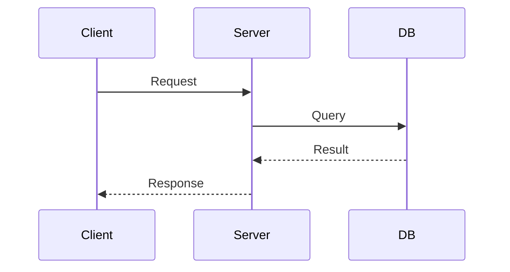

# {API Name} Design Document

## Table of Contents

- [Revision History](#revision-history)
- [Overview](#overview)
- [Processing Flow](#processing-flow)
- [API List](#api-list)
- (Links to each API detail section)
- [DB Design](#db-design)

## Revision History

| Date | Version | Source Commit | Changes |
|------|---------|---------------|---------|
| YYYY-MM-DD | 1.0 | `abc1234` | Initial version |

## Overview

{Purpose and responsibilities of this API group in 1-3 sentences}

## Processing Flow

{Overall sequence of main processing. Include when data flows between 2+ components}



## API List

| Method | Path | Auth | Description |
|--------|------|------|-------------|
| GET | `/api/...` | JWT | {description} |

## {API Name}

| Item | Value |
|------|-------|
| Method | GET / POST / PUT / DELETE |
| Path | `/api/...` |
| Auth | None / JWT / API Key |

### Request Parameters

| Parameter | Type | Required | Description |
|-----------|------|----------|-------------|
| {name} | {type} | {required/optional} | {description including validation rules} |

### Response (Success)

```json
{
  "example": "JSON sample based on implementation"
}
```

### Error Response

| HTTP Status | Error Message | Condition |
|-------------|---------------|-----------|
| 400 | Validation error | {condition} |
| 404 | Not found | {condition} |

### Processing Flow

1. **{Target} — {Action}**

   **File:** `{file path}`
   **Method:** `{method name}`

   {Processing description}

## DB Design

{Column definitions for tables operated by this API}

### {Table Name}

| Column | Type | Constraints | Description |
|--------|------|-------------|-------------|
| `{table_name}.{column_name}` | {type} | {constraints} | {description} |
