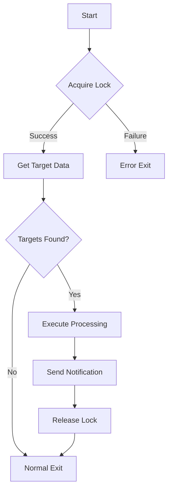

# {Process Name} Design Document

## Table of Contents

- [Revision History](#revision-history)
- [Overview](#overview)
- [Execution Specifications](#execution-specifications)
- [Processing Flow](#processing-flow)
- [Target Data](#target-data)
- [Notifications](#notifications)
- [Error Handling](#error-handling)

## Revision History

| Date | Version | Source Commit | Changes |
|------|---------|---------------|---------|
| YYYY-MM-DD | 1.0 | `abc1234` | Initial version |

## Overview

{Purpose and responsibilities of this batch process in 1-3 sentences}

## Execution Specifications

### Schedule

| Item | Value |
|------|-------|
| Timing | {cron expression or manual} |
| Command | `node {path}` |
| Dry-run | `node {path}` (default) |
| Execute | `node {path} --force` |

### Exclusive Control

| Item | Value |
|------|-------|
| Method | {lock file / DB lock etc.} |
| Lock file | `{path}` |
| On duplicate | Error exit |

## Processing Flow



1. **{Target} — {Action}**

   **File:** `{file path}`
   **Method:** `{method name}`

   {Processing description}

## Target Data

{Conditions for target data}

```sql
-- Target data extraction conditions (reference)
SELECT * FROM {table_name}
WHERE {conditions}
ORDER BY {sort};
```

## Notifications

| Condition | Destination | Content |
|-----------|-------------|---------|
| Success | {Slack / email etc.} | {count etc.} |
| Error | {Slack / email etc.} | {error details} |

## Error Handling

| Error Type | Response |
|------------|----------|
| DB connection error | {retry/exit etc.} |
| Lock acquisition failure | Error exit (another process running) |
| Processing error | {rollback/skip etc.} |
