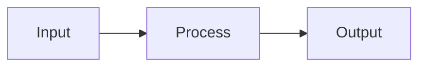
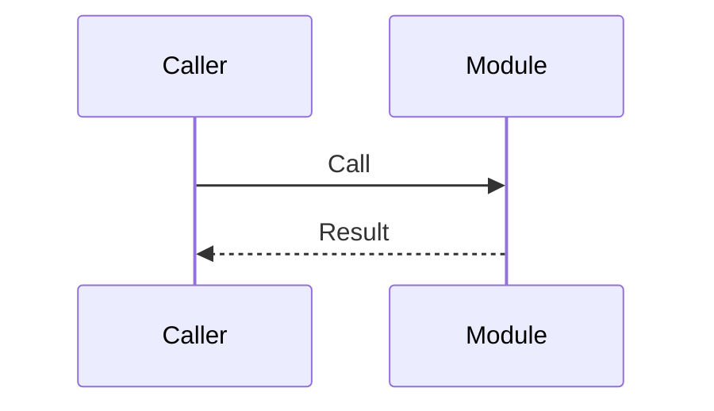

# {Feature Name} Design Document

## Table of Contents

- [Revision History](#revision-history)
- [Overview](#overview)
- [Processing Flow](#processing-flow)
- (Links to pattern-specific sections)
- [Common Processing](#common-processing)
- [Data Structures](#data-structures)

## Revision History

| Date | Version | Source Commit | Changes |
|------|---------|---------------|---------|
| YYYY-MM-DD | 1.0 | `abc1234` | Initial version |

## Overview

{Purpose and responsibilities of this feature in 1-3 sentences}



## Processing Flow

{Main processing flow diagram}



1. **{Target} — {Action}**

   **File:** `{file path}`
   **Method:** `{method name}`

   {Processing description}

## {Processing Pattern Name}

{Logic and branching for each pattern. Repeat this section for multiple patterns}

### Input

| Parameter | Type | Required | Description |
|-----------|------|----------|-------------|
| {name} | {type} | {required/optional} | {description} |

### Processing

{Branch conditions, transformation logic, etc.}

### Output

{Result structure}

## Common Processing

{Logic shared across multiple patterns. Utility functions, etc.}

## Data Structures

### Input

```json
{
  "example": "Input data JSON structure"
}
```

### Output

```json
{
  "example": "Output data JSON structure"
}
```

### Related Tables

| Column | Type | Constraints | Description |
|--------|------|-------------|-------------|
| `{table_name}.{column_name}` | {type} | {constraints} | {description} |
