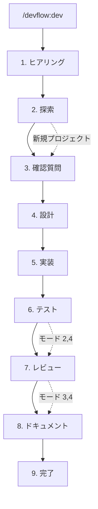

[English](README.md) | [日本語](README.ja.md)

# DevFlow

作りたいものを伝えるだけ。設計、テスト、README — 全部完成。

DevFlow は Claude Code プラグイン。6 つの専門エージェントが開発サイクル全体を自動で処理する — コードベース分析から、設計、実装、テスト、レビュー、ドキュメントまで。仕様書は不要。DevFlow が適切な質問から始める。

## クイックスタート

[Claude Code](https://claude.com/claude-code) >= 1.0.0 が必要。

```
/plugin marketplace add shumatsumonobu/dotagents
/plugin install devflow@dotagents
```

インストール後、Claude Code を再起動。`/agents` で確認。

> [!NOTE]
> `agents: Invalid input` エラーが出たら、キャッシュをクリアして再試行:
> ```
> rm -rf ~/.claude/plugins/cache/
> /plugin install devflow@dotagents
> ```

## 使用イメージ

```
あなた:  /devflow:dev
         "Gemini API を使ってチャット機能を追加"

DevFlow: いくつか質問:
         - Web UI と CLI、どっち？
         - 会話履歴を保存する？
あなた:  Web UI。セッション限りで。

DevFlow: どの開発モード？
         [1. Full]  [2. No test]  [3. No review]  [4. Speed]
あなた:  （"4. Speed" をクリック）

DevFlow: → explorer がコードベースを分析中...
         → planner が 3 つのアーキテクチャを提案中...
         → どれ？ [Option 1] [Option 2] [Option 3]
あなた:  （"Option 2" をクリック）
         → coder x2 が並列実装中...
         → documenter がドキュメント生成中...
         完了!
```

1 つの指示で、開発サイクル完結。

## コマンド

```bash
/devflow:dev       # フルパイプライン — ヒアリング → 設計 → 実装 → テスト → レビュー → ドキュメント
/devflow:explore   # コードベース構造を分析
/devflow:design    # 設計書を作成
/devflow:review    # 信頼度スコアリング付きコードレビュー
/devflow:test      # テスト実行
/devflow:docs      # ドキュメント生成
/devflow:history   # 過去のセッションを閲覧
```

または直接エージェントを呼び出し: `@devflow:explorer` `@devflow:planner` `@devflow:coder` `@devflow:tester` `@devflow:reviewer` `@devflow:documenter`

## パイプライン



| モード | パイプライン | 使うタイミング |
|-------|------------|--------------|
| 1. Full | 設計 → 実装 → テスト → レビュー → ドキュメント | プロダクション品質（推奨） |
| 2. No test | 設計 → 実装 → レビュー → ドキュメント | テストが既に存在する場合 |
| 3. No review | 設計 → 実装 → テスト → ドキュメント | 信頼できる内部コード |
| 4. Speed | 設計 → 実装 → ドキュメント | プロトタイプ、実験 |

## エージェント

| エージェント | 役割 |
|------------|------|
| **explorer** | コードベース分析 — 実行パス追跡、アーキテクチャマッピング。読み取り専用 |
| **planner** | 3 つのアーキテクチャ候補を賛否付きで提案 → `docs/DESIGN.md` |
| **coder** | プロジェクト規約に従ってコード実装。TS/JS, Python, Go, Rust 対応 |
| **tester** | テストを記述・実行。失敗時は auto-fix → 再テスト（最大 3 回） |
| **reviewer** | 品質とセキュリティのレビュー。信頼度 75/100 以上の指摘のみ報告 |
| **documenter** | 必要に応じて README、API 仕様、アーキテクチャ文書を生成 |

## 主な機能

**会話形式の要件定義** — 仕様書を書く代わりに質問に答えるだけ。「おすすめで」と言えば、DevFlow がベストプラクティスを選ぶ。

**アーキテクチャ候補** — planner が 3 案をトレードオフ付きで提案。コードを書く前に選ぶ。

**並列実行** — 複数の coder が同時に動作。coder が実装している間に tester が仕様を設計。

**Auto-fix ループ** — テスト失敗 → coder が修正 → 再テスト。最大 3 回、手動介入不要。

**信頼度スコアリング** — reviewer が各指摘に 0〜100 のスコアを付ける。信頼度の高い問題のみ報告。

**セキュリティチェック** — XSS、SQL インジェクション、コマンドインジェクション、CSRF、シークレット漏洩、パストラバーサル、加えて言語固有のチェック。

**セッション永続化** — 進捗を `.devflow/session.md` に保存。中断やコンテキスト圧縮後に再開可能。完了セッションは `.devflow/history/` にアーカイブ。

**メモリ** — エージェントがセッション間でパターンを記憶。使うほど速くなる。

## Tips

- **デフォルトは Full モード** — プロトタイプ以外ではテスト/レビューをスキップしない
- **「おすすめで」と言う** — 技術選定に迷ったら一言。DevFlow が決める
- **具体的に書く** — 「登録/ログイン付きの JWT 認証を追加」は「認証を追加」より良い
- **先に探索する** — 複雑なコードベースでは開発前に `/devflow:explore` を実行
- **個別コマンドを使う** — レビューだけなら `/devflow:review`、ドキュメントだけなら `/devflow:docs`

## アンインストール

```
/plugin uninstall devflow@dotagents
```

## 更新

```
rm -rf ~/.claude/plugins/cache/
cd ~/.claude/plugins/marketplaces/dotagents && git pull
```

更新後は Claude Code を再起動。

## リンク

- [Claude Code Plugins](https://code.claude.com/docs/en/plugins)
- [Sub-agents](https://code.claude.com/docs/en/sub-agents)
- [Plugin Marketplace](https://code.claude.com/docs/en/plugin-marketplaces)

## ライセンス

MIT

## 作者

shumatsumonobu ([@shumatsumonobu](https://github.com/shumatsumonobu)) / [X](https://x.com/shumatsumonobu)
