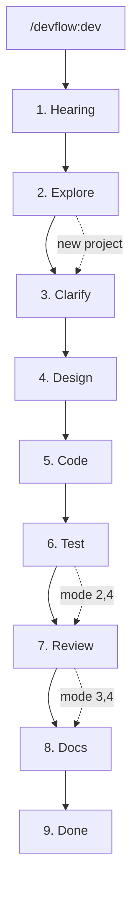

# DevFlow

Just say what you want to build. Design, tests, README — done.

DevFlow is a Claude Code plugin. 6 specialized agents handle the full development cycle automatically — from codebase analysis through design, implementation, testing, review, and documentation. No spec doc needed; it starts by asking the right questions.

## Quick Start

Requires [Claude Code](https://claude.com/claude-code) >= 1.0.0.

```
/plugin marketplace add shumatsumonobu/dotagents
/plugin install devflow@dotagents
```

Restart Claude Code after installation. Run `/agents` to verify.

> [!NOTE]
> If you get `agents: Invalid input`, clear cache and retry:
> ```
> rm -rf ~/.claude/plugins/cache/
> /plugin install devflow@dotagents
> ```

## What It Looks Like

```
You:     /devflow:dev
         "Add a chat feature using Gemini API"

DevFlow: A few questions:
         - Web UI or CLI?
         - Save conversation history?
You:     Web UI. Session-only is fine.

DevFlow: Which development mode?
         [1. Full]  [2. No test]  [3. No review]  [4. Speed]
You:     (clicks "4. Speed")

DevFlow: → explorer analyzing codebase...
         → planner proposing 3 architectures...
         → Which one? [Option 1] [Option 2] [Option 3]
You:     (clicks "Option 2")
         → coder x2 implementing in parallel...
         → documenter generating docs...
         Done!
```

One instruction. Full development cycle.

## Commands

```bash
/devflow:dev       # Full pipeline — hearing → design → code → test → review → docs
/devflow:explore   # Analyze codebase structure
/devflow:design    # Create design document
/devflow:review    # Code review with confidence scoring
/devflow:test      # Run tests
/devflow:docs      # Generate documentation
/devflow:history   # Browse past sessions
```

Or call agents directly: `@devflow:explorer` `@devflow:planner` `@devflow:coder` `@devflow:tester` `@devflow:reviewer` `@devflow:documenter`

## The Pipeline



| Mode | Pipeline | When to use |
|------|----------|-------------|
| 1. Full | Design → Code → Test → Review → Docs | Production-ready (recommended) |
| 2. No test | Design → Code → Review → Docs | Tests already exist |
| 3. No review | Design → Code → Test → Docs | Trusted internal code |
| 4. Speed | Design → Code → Docs | Prototypes, experiments |

## Agents

| Agent | What it does |
|-------|-------------|
| **explorer** | Analyzes codebase — traces execution paths, maps architecture. Read-only |
| **planner** | Proposes 3 architecture candidates with pros/cons → `docs/DESIGN.md` |
| **coder** | Implements code following project conventions. TS/JS, Python, Go, Rust |
| **tester** | Writes and runs tests. Failures trigger auto-fix → retest (up to 3x) |
| **reviewer** | Reviews quality and security. Only reports findings with confidence ≥ 75/100 |
| **documenter** | Generates README, API specs, architecture docs as needed |

## Key Features

**Conversational requirements** — Answer a few questions instead of writing spec docs. Say "recommended" to let DevFlow pick best practices for you.

**Architecture candidates** — Planner proposes 3 options with trade-offs. You choose before any code is written.

**Parallel execution** — Multiple coders run simultaneously. Tester designs specs while coders implement.

**Auto-fix loop** — Test fails → coder fixes → retest. Up to 3 rounds, zero manual intervention.

**Confidence scoring** — Reviewer scores each finding 0–100. Only high-confidence issues are reported.

**Security checks** — XSS, SQL injection, command injection, CSRF, secret exposure, path traversal, plus language-specific checks.

**Session persistence** — Progress saved to `.devflow/session.md`. Resume after interruption or context compaction. Completed sessions archived to `.devflow/history/`.

**Memory** — Agents remember patterns across sessions. Gets faster the more you use it.

## Tips

- **Default to full mode** — Skip tests/review only for prototypes
- **Say "recommended"** — Unsure about tech choices? One word and DevFlow decides
- **Be specific** — "Add JWT auth with register/login" beats "add authentication"
- **Explore first** — Run `/devflow:explore` before developing on complex codebases
- **Use individual commands** — `/devflow:review` for review only, `/devflow:docs` for docs only

## Uninstall

```
/plugin uninstall devflow@dotagents
```

## Update

```
rm -rf ~/.claude/plugins/cache/
cd ~/.claude/plugins/marketplaces/dotagents && git pull
```

Restart Claude Code after updating.

## Links

- [Claude Code Plugins](https://code.claude.com/docs/en/plugins)
- [Sub-agents](https://code.claude.com/docs/en/sub-agents)
- [Plugin Marketplace](https://code.claude.com/docs/en/plugin-marketplaces)

## License

MIT

## Author

shumatsumonobu ([@shumatsumonobu](https://github.com/shumatsumonobu)) / [X](https://x.com/shumatsumonobu)
