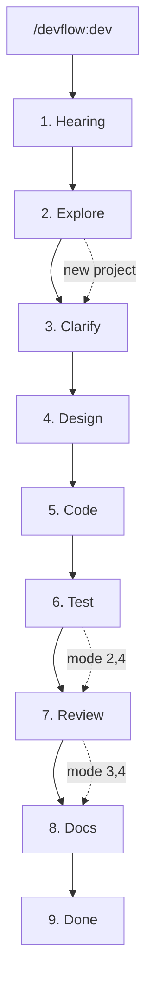

# DevFlow

Just say what you want to build. Design, tests, README — done.

DevFlow is a Claude Code plugin. 6 specialized agents handle the full development cycle automatically — from codebase analysis through design, implementation, testing, review, and documentation. No spec doc needed; it starts by asking the right questions.

## Quick Start

```shell
/plugin marketplace add shumatsumonobu/dotagents
/plugin install devflow@dotagents
```

The install summary says whether the plugin is live. `Plugin is now active.` means it is;
`Run /reload-plugins to activate.` means run that command.

> [!NOTE]
> If the skills do not appear, clear the plugin cache, restart, and install again:
> ```shell
> rm -rf ~/.claude/plugins/cache
> ```

## What a session asks you

Three decisions, then it runs.

1. **What you want** — a few questions in place of a spec document. Answer `recommended` and
   DevFlow picks.
2. **Which mode** — full, no test, no review, or speed. The table below says what each drops.
3. **Which architecture** — the planner writes three candidates with their trade-offs into
   `docs/DESIGN.md`. You pick before anything is implemented.

After that the pipeline runs to the end on its own, pausing only when a review finding needs a
decision.

## Commands

```shell
/devflow:dev       # Full pipeline — hearing → design → code → test → review → docs
/devflow:explore   # Analyze codebase structure
/devflow:design    # Create design document
/devflow:review    # Code review with confidence scoring
/devflow:test      # Run tests
/devflow:docs      # Generate documentation
/devflow:history   # Browse past sessions
```

Or call agents directly: `@devflow:explorer` `@devflow:planner` `@devflow:coder` `@devflow:tester` `@devflow:reviewer` `@devflow:documenter`

## The Pipeline


```mermaid
flowchart TD
    A["/devflow:dev"] --> B["1. Hearing"]
    B --> C["2. Explore"]
    C --> D["3. Clarify"]
    D --> E["4. Design"]
    E --> F["5. Code"]
    F --> G["6. Test"]
    G --> H["7. Review"]
    H --> I["8. Docs"]
    I --> J["9. Done"]

    C -. "new project" .-> D
    G -. "mode 2,4" .-> H
    H -. "mode 3,4" .-> I
```

| Mode | Pipeline | When to use |
|------|----------|-------------|
| 1. Full | Design → Code → Test → Review → Docs | Production-ready (recommended) |
| 2. No test | Design → Code → Review → Docs | Tests already exist |
| 3. No review | Design → Code → Test → Docs | Trusted internal code |
| 4. Speed | Design → Code → Docs | Prototypes, experiments |

## Agents

| Agent | What it does |
|-------|-------------|
| **explorer** | Analyzes codebase — traces execution paths, maps architecture. Read-only |
| **planner** | Proposes 3 architecture candidates with pros/cons → `docs/DESIGN.md` |
| **coder** | Implements code following project conventions. TS/JS, Python, Go, Rust |
| **tester** | Writes and runs tests. Failures trigger auto-fix → retest (up to 3x) |
| **reviewer** | Reviews quality and security. Only reports findings with confidence ≥ 75/100 |
| **documenter** | Generates README, API specs, architecture docs as needed |

## Key Features

**Conversational requirements** — Answer a few questions instead of writing spec docs. Say "recommended" to let DevFlow pick best practices for you.

**Architecture candidates** — Planner proposes 3 options with trade-offs. You choose before any code is written.

**Parallel execution** — Multiple coders run simultaneously. Tester designs specs while coders implement.

**Auto-fix loop** — Test fails → coder fixes → retest. Up to 3 rounds, zero manual intervention.

**Confidence scoring** — Reviewer scores each finding 0–100. Only high-confidence issues are reported.

**Security checks** — XSS, SQL injection, command injection, CSRF, secret exposure, path traversal, plus language-specific checks.

**Session persistence** — Progress saved to `.devflow/session.md`. Resume after interruption or context compaction. Completed sessions archived to `.devflow/history/`.

**Memory** — Agents carry `memory: project`, so what they learn about a codebase is scoped to it
and available in later sessions.

## Tips

- **Default to full mode** — Skip tests/review only for prototypes
- **Say "recommended"** — Unsure about tech choices? One word and DevFlow decides
- **Be specific** — "Add JWT auth with register/login" beats "add authentication"
- **Explore first** — Run `/devflow:explore` before developing on complex codebases
- **Use individual commands** — `/devflow:review` for review only, `/devflow:docs` for docs only

## Update

Third-party marketplaces do not auto-update, so pull changes yourself:

```shell
/plugin marketplace update dotagents
```

Claude Code then updates the installed plugin and tells you to run `/reload-plugins`.

## Uninstall

```shell
/plugin uninstall devflow@dotagents
```

## Links

- [Claude Code Plugins](https://code.claude.com/docs/en/plugins)
- [Sub-agents](https://code.claude.com/docs/en/sub-agents)
- [Plugin Marketplace](https://code.claude.com/docs/en/plugin-marketplaces)

## License

MIT

## Author

shumatsumonobu ([@shumatsumonobu](https://github.com/shumatsumonobu)) / [X](https://x.com/shumatsumonobu)
